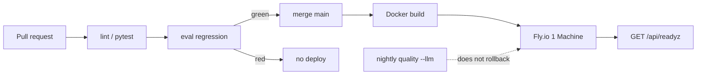

# KnowledgeHub


[](https://github.com/kq409/researchpilot/actions/workflows/ci.yml)

Knowledge base for capturing ideas, organizing papers, and asking questions against your own library.

Voice notes go through local Whisper transcription and LLM cleanup, then become structured research notes. Papers live in a searchable library. Chat retrieves over what you have stored, and can search the web for field-wide or latest-progress questions when configured.

**Features:**

- Voice notes: browser recording or audio upload, Whisper speech-to-text, optional LLM cleanup
- Structured research notes with review status (generated → draft → reviewed → accepted)
- Paper library with metadata, tags, and GROBID parsing
- Chat: retrieve from notes and papers, with citations; optional web search for SOTA / ArXiv / outside the library
- Compare: side-by-side comparison across selected papers
- Eval: retrieval and agent suites with a transcript viewer
- MCP: read-only library tools for Cursor
- OpenAI-compatible LLM API (Ollama, LM Studio, OpenAI, or any compatible endpoint)

---

## Quick Start

### Dev Container (Recommended)

**This project is devcontainer-first.**

#### 1. Prerequisites

- [Docker Desktop](https://www.docker.com/products/docker-desktop/)
- [VS Code](https://code.visualstudio.com/)
- [Dev Containers extension](https://marketplace.visualstudio.com/items?itemName=ms-vscode-remote.remote-containers)

#### 2. Open in Dev Container

- Click **"Reopen in Container"** in VS Code
- Or: `Cmd/Ctrl+Shift+P` → **"Dev Containers: Reopen in Container"**
- Wait ~5-10 minutes for initial build and model download

VS Code automatically:

1. Builds and starts the app, Ollama, PostgreSQL, and GROBID containers
2. Installs Python and Node.js dependencies
3. Downloads the Ollama models
4. Creates `backend/.env` with working defaults

Skip to [Running the App](#running-the-app).

---

### GitHub Codespaces

GitHub Codespaces can run this project's devcontainer in the cloud.

1. Open this repository on GitHub → **"Code"** → **"Codespaces"** → **"Create codespace"**
2. The devcontainer asks for at least **4 cores**; more CPU and RAM is better
3. Wait ~5-10 minutes for initial setup

Ports 3000, 8000, and 11434 are forwarded automatically. Use the port 3000 link or the **Ports** tab for the frontend.

If you need true `localhost` access:

1. Install the [GitHub Codespaces extension](https://marketplace.visualstudio.com/items?itemName=GitHub.codespaces) in VS Code Desktop
2. Connect to the running Codespace
3. Ports forward to your machine's `localhost`

Stop the Codespace when idle at [github.com/codespaces](https://github.com/codespaces). Any platform that supports devcontainers (Gitpod, DevPod, etc.) can also use `.devcontainer`.

---

### Manual Installation

The devcontainer is the supported setup. If you install manually, you need:

- Python 3.12+, Node.js 24+, [uv](https://docs.astral.sh/uv/), PostgreSQL with pgvector, and an LLM server ([Ollama](https://ollama.com/) or [LM Studio](https://lmstudio.ai/))
- Copy `backend/.env.example` to `backend/.env` and configure
- Install dependencies with `uv sync` (backend) and `npm install` (frontend)
- Start your LLM server and pull models: `ollama pull gemma3:4b` and `ollama pull nomic-embed-text`

---

## Running the App

Open **two terminals** and run:

**Terminal 1 - Backend:**

```bash
cd backend
uv sync && uv run uvicorn app:app --reload --host 0.0.0.0 --port 8000 --timeout-keep-alive 600
```

`uv sync` refreshes dependencies. `--timeout-keep-alive 600` allows long audio and paper processing.

**Terminal 2 - Frontend:**

```bash
cd frontend
npm install && npm run dev
```

**Browser:** Open `http://localhost:3000`

---

## Configuration

KnowledgeHub talks to any OpenAI-compatible LLM provider:

- **Ollama** (default in the devcontainer)
- **LM Studio**
- **OpenAI API**
- Any other OpenAI-compatible API

The devcontainer creates `backend/.env` with Ollama defaults. To switch providers, edit:

- `LLM_BASE_URL` — API endpoint
- `LLM_API_KEY` — API key (never commit real keys)
- `LLM_MODEL` — Model name
- `LLM_REASONING_EFFORT` — global default `none` / `low` / `medium` / `high`
- Optional per-path overrides: `ASK_REASONING_EFFORT`, `CHAT_REASONING_EFFORT`,
  `COMPARE_REASONING_EFFORT`, `JUDGE_REASONING_EFFORT` (Judge defaults to `none`)
- `ASK_MAX_TOKENS` / `CHAT_MAX_TOKENS` — generation ceilings (default **4096**)
- `COMPARE_MAX_TOKENS` / `AGENT_COMPARE_MAX_TOKENS` — Compare ceilings (raise if
  high reasoning effort truncates JSON)
- `JUDGE_MODEL` — cheaper reviewer when the main model is a large reasoning model

### DeepSeek (chat) + Ollama (embeddings)

Keep chat and embeddings on separate hosts — DeepSeek does not serve
`nomic-embed-text`. Example `backend/.env` block:

```env
LLM_BASE_URL=https://api.deepseek.com
LLM_API_KEY=sk-your-key
LLM_MODEL=deepseek-v4-flash
LLM_REASONING_EFFORT=high
ASK_REASONING_EFFORT=none
CHAT_REASONING_EFFORT=low
JUDGE_REASONING_EFFORT=none
JUDGE_MODEL=deepseek-v4-flash
ASK_MAX_TOKENS=4096
CHAT_MAX_TOKENS=4096

EMBEDDING_BASE_URL=http://ollama:11434/v1
EMBEDDING_API_KEY=ollama
EMBEDDING_MODEL=nomic-embed-text
```

If Ask/Chat return HTTP 404 mentioning an embedding model, the chat host is
being used for embeddings — fix `EMBEDDING_*`, do not point them at DeepSeek.

Chat `web_search` (field-wide / SOTA / ArXiv questions) uses the DeepSeek
Responses API, independent of `LLM_BASE_URL`:

```env
WEB_SEARCH_BASE_URL=https://api.deepseek.com
WEB_SEARCH_API_KEY=sk-your-key
WEB_SEARCH_MODEL=deepseek-v4-flash
```

Dummy values (`ollama`, `changeme`, empty) count as unset. Without a real key,
Chat says web search is not configured and stays in the library.

---

## Tests and CI

Push and pull requests to `main` run [GitHub Actions](.github/workflows/ci.yml). Two jobs run in parallel:

- **Backend:** pgvector Postgres, Alembic migrations, Ruff, Black, pytest
- **Frontend:** Node 24, `npm ci`, type-check, ESLint, production build

LLM, GROBID, and Whisper are mocked in tests. You do not need Ollama for CI.

**Local equivalents** (Postgres with pgvector must be running; the devcontainer already provides it):

```bash
# backend
cd backend
uv sync --extra dev
uv run alembic upgrade head
uv run ruff check .
uv run black --check .
uv run pytest --tb=short

# frontend
cd frontend
npm ci
npm run type-check
npm run lint
npm run build
```

Set `DATABASE_URL` (see `backend/.env.example`). Without it, API tests that need Postgres skip and the suite can look green while skipping most coverage.

Eval **regression** is the promotion condition: if those suites fail, CI is red and [Deploy](.github/workflows/deploy.yml) does not run. Nightly `--llm` quality never blocks merge or rolls back production.

### Continual distribution



Public demo is a **thin** config, not the 16GB devcontainer:

| Dependency | Demo |
|---|---|
| Chat LLM | Cloud OpenAI-compatible (DeepSeek). Keys stay on the host. |
| Embeddings | Separate `EMBEDDING_*` host. Never point chat URL at embed. |
| Postgres + pgvector | Neon / Supabase, not on the API machine. |
| GROBID | Off; papers parse with pypdf. GROBID stays in local / 录屏. |
| Whisper | `WHISPER_ENABLED=false`; mic UI is hidden. |
| Object storage | Fly volume at `/data` (`Storage` protocol). |
| Replicas | **1**. Approval Futures cannot cross machines. |

`Dockerfile` + `fly.toml` are in the repo. First deploy is `fly launch` (creates `*.fly.dev`). Create volume `knowledgehub_data`, set secrets (`DATABASE_URL`, `LLM_*`, `EMBEDDING_*`, `EVAL_TOKEN`, `DEMO_RESET_TOKEN`), then `fly deploy`. GitHub `FLY_API_TOKEN` empty → deploy job **skips** so forks stay green.

**Approximate cost:** Fly shared-cpu 1GB ~$6/mo (kept running so a stranger is not stuck on a cold start) + 1GB volume + Neon free tier + pay-per-token chat. Nightly quality adds LLM spend only when secrets exist.

**ACL demo script** (header switcher is `X-User-Id`, not SSO):

1. Open the demo as **alice**. Search `ZXQ-YS-2023-001` — the finance budget paper is visible.
2. Switch to **bob** and reload. That document number disappears; `ZXQ-HT-2023-014` is visible instead.
3. Chat/Ask as bob must not cite alice's budget. Uploads, mic, and `POST /api/eval/run` stay locked.

### What this repo does not do yet

- SSO / real identity (alice/bob is a stub)
- Multi-replica approvals or a shared approval store
- Ingest job queue (parse/embed still `asyncio.create_task` in-process)
- Kubernetes, blue-green, or SharePoint
- MinIO/S3 (local disk implements `Storage`)
- GROBID / Whisper on the public demo
- 保管期限 / 四性 / real customer records

### Evaluation

Eval suites live in `backend/eval/suites/`. They seed a tagged synthetic ZXQ* library. **Keyword embeddings used without `--llm` only prove the fixture and graders agree** — they are not a retrieval-quality score.

| Suite | What it measures | CI | LLM |
|---|---|---|---|
| `ask-regression` | Acronym retrieval + abstain flags | Gate (must pass) | No |
| `chat-regression` | Outcome/citation/abstain references; with `--llm`, the production agent | Gate without `--llm` (references) | Optional |
| `acl-regression` | Space ACL: Alice cannot retrieve Bob's records | Gate (must pass) | No |
| `search-regression` | Catalog search + same ACL SQL as RAG (doc numbers, space filter) | Gate (must pass) | No |
| `discipline-regression` | Un-accessioned originals stay out of search; blank OCR abstains | Gate (must pass) | No |
| `ask-quality` | Semantic retrieval, coverage facts, faithfulness | Nightly only | Optional / `--llm` |
| `chat-quality` | Grounded answers, pass@k / pass^k, in-scope / out-of-scope | Nightly only | `--llm` |
| `search-quality` | Semantic qrels; **real vectors** with `--embeddings` | Nightly only | `--embeddings` (not SOTA) |

```bash
cd backend
# CD gate (same as GitHub Actions)
uv run python -m eval.harness --check-references --suite all
uv run python -m eval.harness --suite ask-regression
uv run python -m eval.harness --suite chat-regression
uv run python -m eval.harness --suite acl-regression
uv run python -m eval.harness --suite search-regression
uv run python -m eval.harness --suite discipline-regression

# Quality (does not block merge)
uv run python -m eval.harness --suite ask-quality --llm
uv run python -m eval.harness --suite chat-quality --llm
uv run python -m eval.harness --suite search-quality --embeddings
```

Aliases: `--suite ask` runs both Ask suites; `--suite chat` both Chat suites. Regression failure exits 1 (`gate: fail`). Quality failures do not fail the regression gate.

Open the Eval panel in the app header to read the **first failing transcript**. `POST /api/eval/run?suite=ask-regression` triggers the Ask regression gate.

See [backend/eval/README.md](backend/eval/README.md) for grader rules and how to read pass@1 vs pass^k.

### MCP (read-only library tools)

The Chat subagent tools (`search_library`, `list_papers`, `list_notes`, `read_paper`, `read_note`, `list_skills`, `load_skill`, `memory_search`) are also an MCP server. Postgres and the embedding host must already be running. Cursor `mcp.json`:

```json
{
  "mcpServers": {
    "knowledgehub": {
      "command": "uv",
      "args": ["run", "python", "-m", "mcp_server"],
      "cwd": "/absolute/path/to/researchpilot/backend"
    }
  }
}
```

Write tools (link/unlink, memory_write, compare) are not exposed.

The chat agent can also *consume* external MCP tools. Copy
`backend/mcp_servers.example.json` to `backend/mcp_servers.json` (or set
`MCP_SERVERS`) with an `allow` list of remote tool names. Names show up as
`mcp__{server}__{tool}`. A server's own `readOnlyHint` is not authorisation;
anything not on `allow` needs in-chat approval.

Write tools in Chat (`memory_write`, `memory_delete`, `link_note`,
`unlink_note`, `connect_note`) pause for a researcher click unless
`ASK_APPROVAL_MODE=off`. The wait is process-local: the replica that started
the turn must receive `POST /api/chat/approve`. That is also the cataloging
"pending review" queue — there is no second accession table for links.

### Preservation vs use

Library records keep two layers:

- **Preservation:** the original bytes, a SHA-256 checksum, and a revision
  number. `put` on an existing storage key fails. A new file is a new revision
  (`data/{kind}/{id}/rN.ext`). Local disk implements a `Storage` protocol so a
  later S3 swap does not rewrite ingest.
- **Use:** chunk/vector indexes. Rebuildable. Search and Ask only see records
  with `accession_status=accessioned`. Uploads start as `received`. Empty
  extractable text (blank or unscanned PDF) is `rejected` and Ask abstains.

Ingest still runs as `asyncio.create_task` in this process. A production
deploy should put parse/embed on a queue.

Optional OCR experiment: download a handful of FUNSD or DocVQA pages locally.
Do not vendor those datasets in this repo.

Hybrid lexical search uses stored `tsvector` columns. Optional FlashRank rerank: set `RERANK_ENABLED=true` (downloads a small ONNX model on first use). Ask/Chat traces always append JSONL under `data/traces/`; set `OPIK_API_KEY` to also send them to Comet Opik.

---

## Troubleshooting

**Container won't start or is very slow:**

This stack runs an LLM on CPU unless a GPU is available. Give Docker enough resources:

1. Open **Docker Desktop** → **Settings** → **Resources**
2. Set **CPUs** as high as you can (8+ cores recommended)
3. Set **Memory** to at least 16GB
4. Click **Apply & Restart**

Expected specs: modern machine with 8+ CPU cores and 16GB RAM.

**Microphone not working:**

- Use Chrome or Firefox (Safari may have issues)
- Check browser permissions: Settings → Privacy → Microphone

**Backend fails to start:**

- Check Whisper model downloads: `~/.cache/huggingface/`
- Ensure enough disk space (models are ~150MB)

**LLM errors:**

- Make sure Ollama is running (it auto-starts with the devcontainer)
- Confirm models downloaded during setup
- Voice transcription still works without the LLM (raw Whisper only)

**LLM is slow:**

- See Docker resource settings above
- Switch `LLM_MODEL` in `backend/.env` (smaller models are faster, weaker at cleanup and extraction)
- Use a cloud API such as OpenAI for faster, higher-quality responses

**Cannot access localhost:3000 or localhost:8000 from the host:**

- **Docker Desktop:** **Settings** → **Resources** → **Network**
- Enable **"Use host networking"** (may require a restart)
- Restart the frontend and backend servers

**Port already in use:**

- Backend: change port with `--port 8001`
- Frontend: edit `vite.config.ts`, change `port: 3000`
